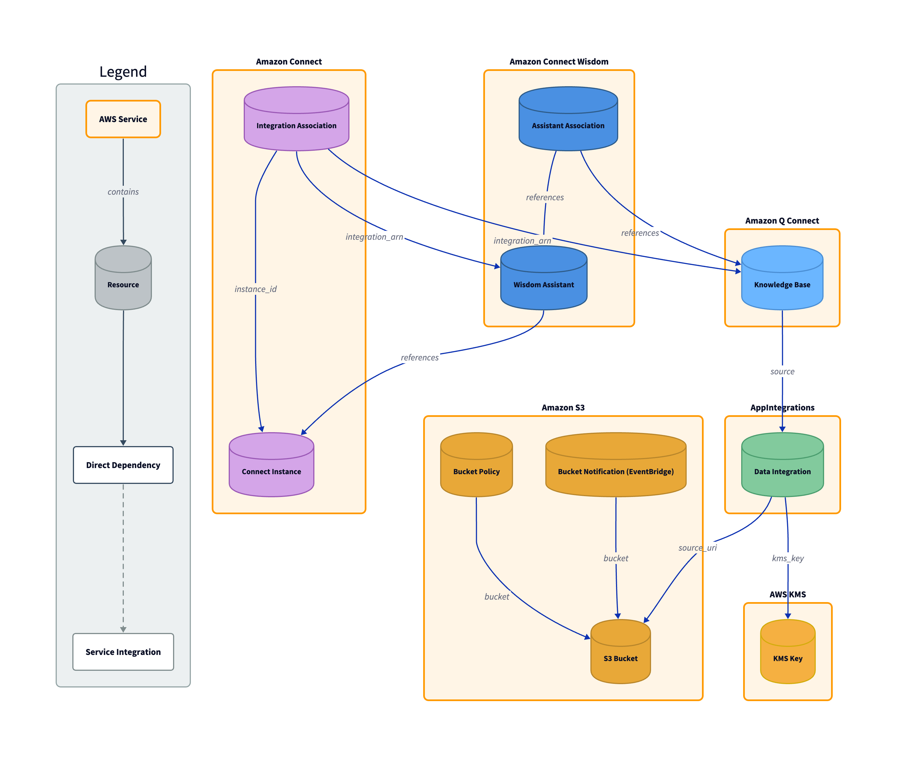

---
# generated by https://github.com/hashicorp/terraform-plugin-docs
page_title: "connectracer Provider"
description: |-
  Provider for AWS Connect and related services
---

# connectracer Provider

The ConnectRacer provider enables Terraform management of AWS Connect and related services including Amazon Q Connect (formerly Wisdom) and AppIntegrations.

## Features

### Automatic Tag Management
All resources in this provider automatically add the **`AmazonConnectEnabled = "True"` tag** required for AWS Connect service-linked role access. This tag is:
- Automatically added during resource creation if not provided
- Preserved during updates
- Visible in Terraform plans before applying
- Cannot be accidentally removed

### Supported Resources

#### Resource Dependencies Overview

The following diagram illustrates how the ConnectRacer resources depend on each other and integrate with AWS services:



#### Amazon Q Connect (Wisdom)
- **`connectracer_wisdom_assistant`** - Manage Wisdom assistants for AI-powered agent assistance
- **`connectracer_wisdom_assistant_association`** - Associate knowledge bases with assistants
- **`connectracer_qconnect_knowledgebase`** - Manage Q Connect knowledge bases for content storage

#### AWS AppIntegrations
- **`connectracer_appintegrations_data_integration`** - Manage data integrations for S3-backed knowledge bases

#### Amazon Connect
- **`connectracer_connect_integration_association`** - Associate Wisdom resources with Connect instances

### Data Sources
- **`connectracer_wisdom_knowledge_bases`** - List all Wisdom knowledge bases
- **`connectracer_wisdom_assistants`** - List all Wisdom assistants
- **`connectracer_qconnect_knowledgebase`** - Get details of a specific knowledge base

## Authentication

The provider uses the AWS SDK v2 default credential chain. Configure AWS credentials using:

- Environment variables (`AWS_ACCESS_KEY_ID`, `AWS_SECRET_ACCESS_KEY`)
- AWS credentials file (`~/.aws/credentials`)
- IAM roles for EC2 instances or ECS tasks
- AWS SSO

## Example Usage

This example demonstrates a complete Amazon Q Connect (Wisdom) setup with S3-backed knowledge base:

```terraform
provider "connectracer" {
  region = "us-east-1"  # Optional, uses AWS SDK default if not specified
}

# Get current AWS account and region
data "aws_caller_identity" "current" {}
data "aws_region" "current" {}

# ==============================================================================
# Wisdom Assistant
# ==============================================================================

resource "connectracer_wisdom_assistant" "example" {
  name        = "my-assistant"
  type        = "AGENT"
  description = "My Wisdom Assistant for customer support"

  tags = {
    Environment = "production"
    Team        = "customer-support"
    # AmazonConnectEnabled = "True" is automatically added
  }
}

# ==============================================================================
# S3 Bucket for Knowledge Base Content
# ==============================================================================

# Generate unique suffix for bucket name
resource "random_id" "kb_suffix" {
  byte_length = 4
}

# Create S3 bucket for knowledge base content
resource "aws_s3_bucket" "kb_bucket" {
  bucket = "kb-${data.aws_caller_identity.current.account_id}-${random_id.kb_suffix.hex}"

  tags = {
    Environment = "production"
    Team        = "customer-support"
    Purpose     = "Knowledge Base Content"
  }
}

# Block public access to the S3 bucket
resource "aws_s3_bucket_public_access_block" "kb_bucket" {
  bucket = aws_s3_bucket.kb_bucket.id

  block_public_acls       = true
  block_public_policy     = true
  ignore_public_acls      = true
  restrict_public_buckets = true
}

# Enable EventBridge notifications for S3 bucket
# This is REQUIRED for EXTERNAL knowledge bases to receive S3 object events
resource "aws_s3_bucket_notification" "kb_bucket_eventbridge" {
  bucket      = aws_s3_bucket.kb_bucket.id
  eventbridge = true
}

# S3 bucket policy to allow AppIntegrations service to read objects
resource "aws_s3_bucket_policy" "kb_bucket" {
  bucket = aws_s3_bucket.kb_bucket.id

  policy = jsonencode({
    Version = "2012-10-17"
    Statement = [
      {
        Sid    = "AllowAppIntegrationsAccess"
        Effect = "Allow"
        Principal = {
          Service = "app-integrations.amazonaws.com"
        }
        Action = [
          "s3:GetObject",
          "s3:ListBucket"
        ]
        Resource = [
          aws_s3_bucket.kb_bucket.arn,
          "${aws_s3_bucket.kb_bucket.arn}/*"
        ]
        Condition = {
          StringEquals = {
            "aws:SourceAccount" = data.aws_caller_identity.current.account_id
          }
        }
      }
    ]
  })
}

# ==============================================================================
# KMS Key for AppIntegrations Encryption
# ==============================================================================

resource "aws_kms_key" "kb_integration" {
  description             = "KMS key for Knowledge Base AppIntegrations"
  deletion_window_in_days = 10
  enable_key_rotation     = true

  policy = jsonencode({
    Version = "2012-10-17"
    Statement = [
      {
        Sid    = "Enable IAM User Permissions"
        Effect = "Allow"
        Principal = {
          AWS = "arn:aws:iam::${data.aws_caller_identity.current.account_id}:root"
        }
        Action   = "kms:*"
        Resource = "*"
      },
      {
        Sid    = "AllowAppIntegrationsUse"
        Effect = "Allow"
        Principal = {
          Service = "app-integrations.amazonaws.com"
        }
        Action = [
          "kms:Decrypt",
          "kms:DescribeKey",
          "kms:CreateGrant"
        ]
        Resource = "*"
        Condition = {
          StringEquals = {
            "kms:ViaService"    = "s3.${data.aws_region.current.name}.amazonaws.com"
            "aws:SourceAccount" = data.aws_caller_identity.current.account_id
          }
        }
      },
      {
        Sid    = "AllowWisdomUse"
        Effect = "Allow"
        Principal = {
          Service = "wisdom.amazonaws.com"
        }
        Action = [
          "kms:Decrypt",
          "kms:DescribeKey"
        ]
        Resource = "*"
        Condition = {
          StringEquals = {
            "aws:SourceAccount" = data.aws_caller_identity.current.account_id
          }
        }
      }
    ]
  })

  tags = {
    Environment = "production"
    Team        = "customer-support"
    Purpose     = "Knowledge Base Integration Encryption"
  }
}

resource "aws_kms_alias" "kb_integration" {
  name          = "alias/kb-integration-${random_id.kb_suffix.hex}"
  target_key_id = aws_kms_key.kb_integration.key_id
}

# ==============================================================================
# AppIntegrations DataIntegration
# ==============================================================================

resource "connectracer_appintegrations_data_integration" "example" {
  name        = "kb-data-integration"
  description = "Data integration for knowledge base S3 bucket"
  source_uri  = "s3://${aws_s3_bucket.kb_bucket.bucket}"
  kms_key     = aws_kms_key.kb_integration.arn

  tags = {
    Environment = "production"
    Team        = "customer-support"
    # AmazonConnectEnabled = "True" is automatically added
  }
}

# ==============================================================================
# Q Connect Knowledge Base
# ==============================================================================

# Create a Q&A Connect knowledge base with EXTERNAL type
# EXTERNAL type works with PDFs when EventBridge is properly configured on the S3 bucket
resource "connectracer_qconnect_knowledgebase" "example" {
  name                = "my-knowledge-base"
  knowledge_base_type = "EXTERNAL"
  description         = "External knowledge base backed by S3"

  tags = {
    Environment = "production"
    Team        = "customer-support"
    # AmazonConnectEnabled = "True" is automatically added
  }

  # Reference the AppIntegration for external content source
  source_configuration = {
    app_integration_arn = connectracer_appintegrations_data_integration.example.arn
  }
}

# ==============================================================================
# Wisdom Assistant Association
# ==============================================================================

# Associate the knowledge base with the Wisdom assistant
resource "connectracer_wisdom_assistant_association" "example" {
  assistant_id     = connectracer_wisdom_assistant.example.id
  association_type = "KNOWLEDGE_BASE"

  association_data = {
    knowledge_base_id = connectracer_qconnect_knowledgebase.example.id
  }

  tags = {
    Environment = "production"
    Team        = "customer-support"
    # AmazonConnectEnabled = "True" is automatically added
  }
}

# ==============================================================================
# Connect Integration Associations
# ==============================================================================
# Associates the Wisdom resources with the Amazon Connect instance
# This enables Wisdom features in the Connect agent workspace

# Associate the Wisdom Assistant with the Connect instance
resource "connectracer_connect_integration_association" "assistant" {
  instance_id      = var.connect_instance_id
  integration_type = "WISDOM_ASSISTANT"
  integration_arn  = connectracer_wisdom_assistant.example.assistant_arn

  tags = {
    Environment = "production"
    Team        = "customer-support"
  }

  depends_on = [connectracer_wisdom_assistant.example]
}

# Associate the Knowledge Base with the Connect instance
resource "connectracer_connect_integration_association" "knowledge_base" {
  instance_id      = var.connect_instance_id
  integration_type = "WISDOM_KNOWLEDGE_BASE"
  integration_arn  = connectracer_qconnect_knowledgebase.example.knowledge_base_arn

  tags = {
    Environment = "production"
    Team        = "customer-support"
  }

  depends_on = [connectracer_qconnect_knowledgebase.example]
}

# ==============================================================================
# Outputs
# ==============================================================================

output "wisdom_assistant_id" {
  description = "The ID of the Wisdom assistant"
  value       = connectracer_wisdom_assistant.example.id
}

output "knowledge_base_id" {
  description = "The ID of the QConnect knowledge base"
  value       = connectracer_qconnect_knowledgebase.example.id
}

output "data_integration_arn" {
  description = "The ARN of the AppIntegrations DataIntegration"
  value       = connectracer_appintegrations_data_integration.example.arn
}

output "knowledge_base_bucket_name" {
  description = "The name of the S3 bucket for knowledge base content"
  value       = aws_s3_bucket.kb_bucket.bucket
}
```

### Key Components Explained

1. **Wisdom Assistant** - AI-powered assistant for agents
2. **S3 Bucket** - Stores knowledge base content (PDFs, documents)
3. **EventBridge** - Required for automatic sync when S3 content changes
4. **KMS Key** - Encrypts data in transit between S3 and AppIntegrations
5. **AppIntegrations DataIntegration** - Connects S3 bucket to Wisdom
6. **Knowledge Base** - Indexes and searches S3 content
7. **Assistant Association** - Links knowledge base to assistant
8. **Connect Integrations** - Enables Wisdom in Connect agent workspace

### Important Notes

- The **`AmazonConnectEnabled = "True"` tag is automatically added** to all Wisdom and AppIntegrations resources
- EventBridge notifications on the S3 bucket are **required** for automatic content synchronization
- AWS automatically creates EventBridge rules for monitoring S3 events (do not manage these in Terraform)
- The KMS key policy must allow both AppIntegrations and Wisdom services

<!-- schema generated by tfplugindocs -->
## Schema

### Optional

- `region` (String) AWS region (optional, uses AWS SDK default resolution if not specified)
